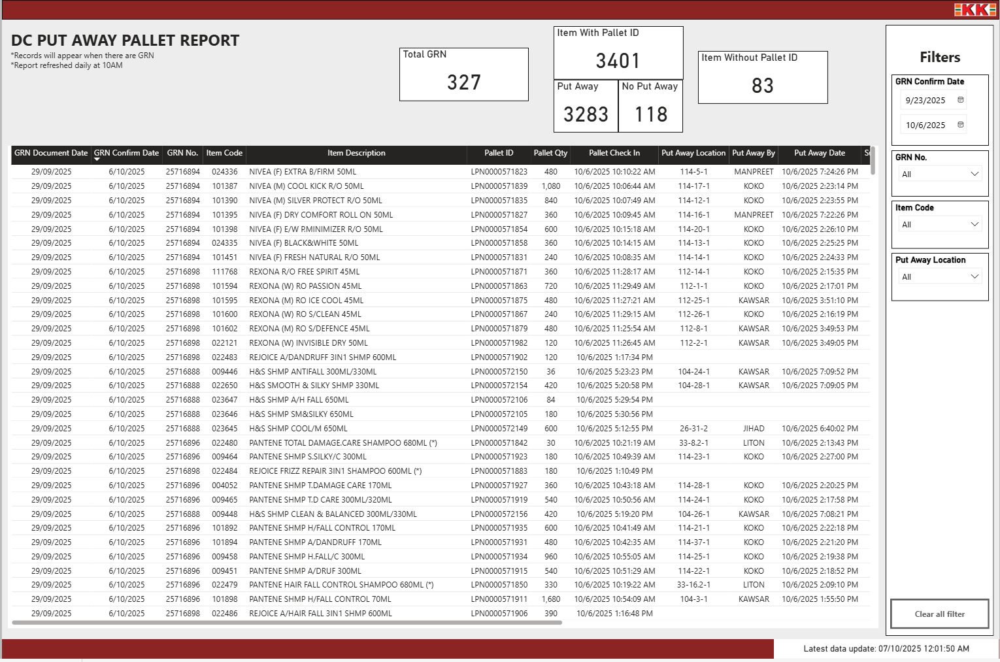

### 🏭 DC Put Away Pallet Report

**Overview**  
This Power BI report monitors daily **Goods Receipt Notes (GRN)** and **Put Away Pallet** activities in the Distribution Center (DC).  
It provides clear visibility into items received and their corresponding put-away status, helping warehouse teams identify pending tasks efficiently.

### 📊 Dashboard Preview

### 🚀 Live Demo
🔗 [View Power BI Dashboard](https://app.powerbi.com/view?r=example)

**🧠 Technical Summary**  
- **Data Source:** Amazon Redshift (single table)  
- **Transformations:** All business logic handled within Power BI using **DAX** and **calculated columns** (no Power Query / M-code).  
- **Data Model:** No relationships — logic derived directly from the imported dataset.  

**📊 Key Metrics**  
- Total GRN Count  
- Items with Pallet ID (Put Away / Not Put Away)  
- Items without Pallet ID  

**✨ Report Features**  
- Dynamic date filtering via slicers for **GRN Confirm Date**  
- Visual indicators for total and incomplete pallet activities  
- Auto-refresh note and **last data refresh timestamp** for transparency  
- Streamlined layout for **control room / big-screen monitoring**  

> 💬 *Records will appear when there are entries in the given date range.*  
> ⏰ *Report auto-refreshes daily at 10 AM.*
